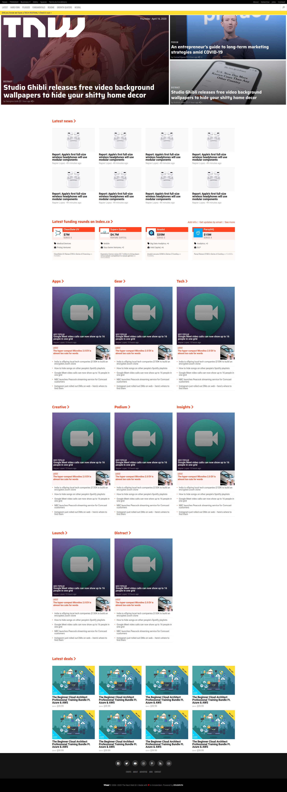

# Responsive-Design
This project consists of replicating the The Next Web website putting emphasis on how it behaves differently depending on the size of the screen where the website is rendered.

# Desktop

# Mobile

# Built With
    HTML,
    CSS

Live Demo

Live Demo Link
Authors

bust_in_silhouette Author1

    Github: @githubhandle
    Twitter: @twitterhandle
    Linkedin: linkedin

bust_in_silhouette Author2

    Github: @githubhandle
    Twitter: @twitterhandle
    Linkedin: linkedin

handshake Contributing

Contributions, issues and feature requests are welcome!

Feel free to check the issues page.
Show your support

Give a star if you like this project!
Acknowledgments

    Hat tip to anyone whose code was used
    Inspiration
    etc

memo License

This project is MIT licensed.