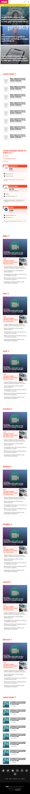

# Responsive-Design
This project consists of replicating the The Next Web website putting emphasis on how it behaves differently depending on the size of the screen where the website is rendered.

# Desktop

# Mobile

## Built With

    HTML,
    CSS

## Live Demo

[Live Demo Link](https://rawcdn.githack.com/Stricks1/TheNextWeb-Clone/81163d6aa654bb645f707f6c8817e39134c580d9/index.html)

## Authors

👤 **Author1**

    Github: @githubhandle
    Twitter: @twitterhandle
    Linkedin: linkedin

👤 **Author2**

    Github: @githubhandle
    Twitter: @twitterhandle
    Linkedin: linkedin

##